# MACHINE LEARNING COM PYTHON FAZENDO USO DA BIBLIOTECA PANDAS

<p>A principal tarefa para engenheiros quando desejam trabalhar com Machine Learning e realizar análise de dados para determinar a viabilidade de encontrar tendências, e então criar um "pipeline" efieciete para treinar o modelo. Este processo envolve
usar bibliotecas como NumPy e Pandas para manipular dados, em conjunto com frameworks como TensorFlow/Keras/PyTorch.</p>

<p>O pandas é muito útil para trabalhar com dataframes, (dataframes é basicamente uma tabela que contém linhas e colunas).</p>
<p>Na figura abaixo temos um exemplo de Dataframe, a área destacada em vermelho é o indice criado automaticamente pela função DataFrame do Pandas Python .</p>


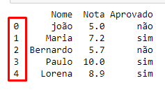
<p>Neste tutorial utilizarei o Jupyter Notebook como ferramenta para desenvolver e executar os códigos.</p>

## Guia de instalação
<p>Para que você possa estar acompanhando este tutorial e também executando em sua máquina este passo a passo, certifique se de que já tenha o Python instalado em seu computador, para consultar se o Python já está instalado, abra o Prompt de comando CMD do windows, e execute o comando python, com isso deverá aparecer Python e sua versão, no MAC ou Linux acesse o Terminal e ao invés de digitar apenas Python, digite Pytonh3.
</p>

<p>caso não tenha o Python instalado, acesse o site oficial do Python, <https://www.python.org/> 
em seguida clique em download e será guiado para página de download  da versão, conforme a ilustra a imagem a seguir, para instalar a última versão clique no botão amarelo conforme aponta a seta 02, então o download será inicializado, após concluir o download, vá até a pasta Python que foi baixada (possivelmente estará na pasta downloads), e clique no executável para efetuar a instalação, todo o processo consiste basicamente clicar  em install, next, next… e finish.</p>

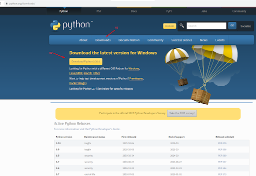

<p>Para instalar o Jupyter notebook, basta instalar o Anacondas que já está com Jupyter Notebook integrado.
Instalando o Anaconda, para isso acesse o site do Anaconda, <https://anaconda.org/>
</p>
<p>Clique em Download anaconda </p>


<p>Após clicar em download Anaconda, que irá te guiar para página seguinte,  role a página até o rodapé e selecione a versão que mais se enquadra com o seu sistema operacional, no meu caso estou usando o windows 64-bit</p>

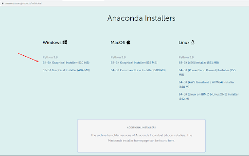

<p>Após efetuado o download, vá até a pasta baixada e clique no executável para efetuar a instalação.</P>

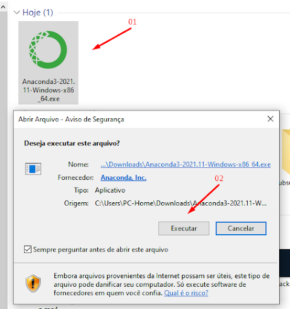
<br>
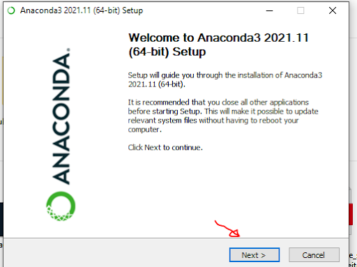

<p>Leia e aceite o termo de licença.</P>

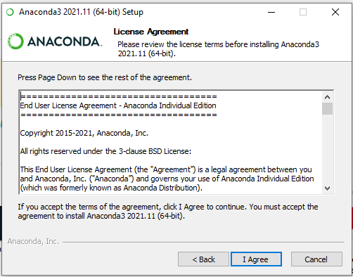
<br>
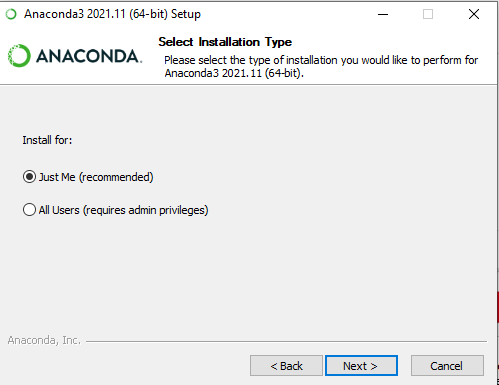

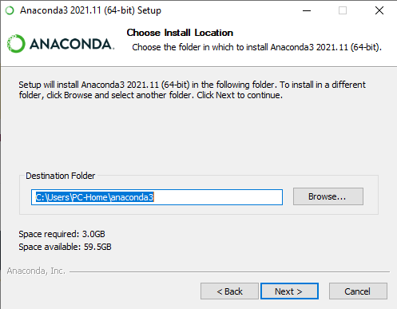

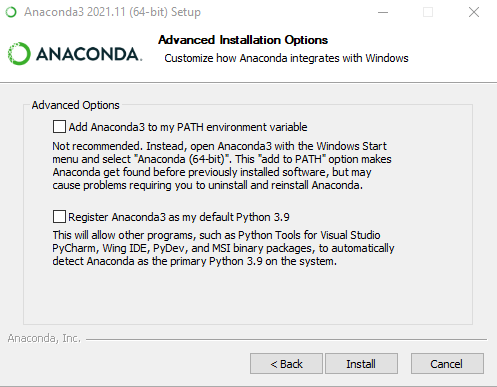


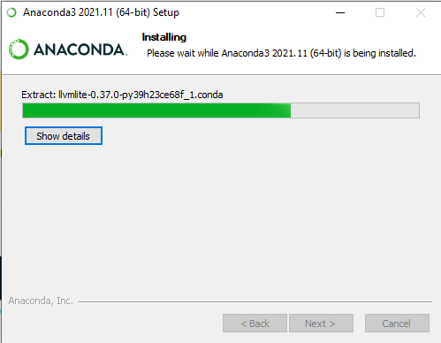

<p>Aguarde a conclusão do Download.</P>

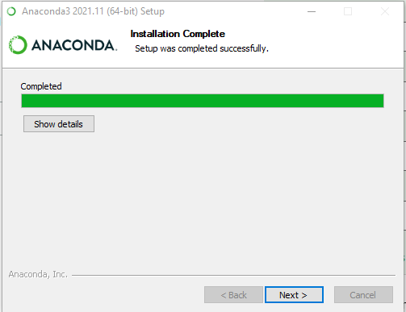

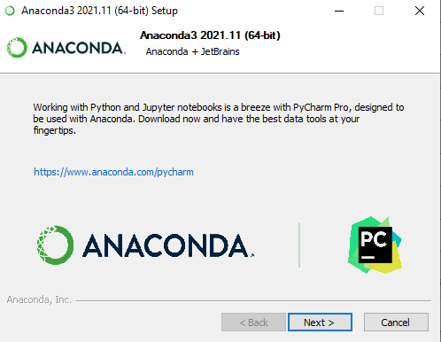
<p>Clicque em finish, para finalizar a instalação.</P>
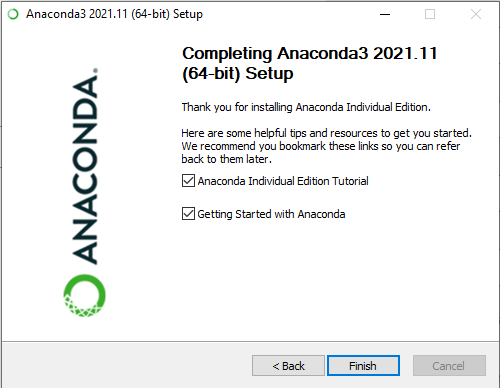
<p>Usuário  Windows, após instalação do Anaconda, vá para o campo de pesquisa, no canto inferior esquerdo e digite Anaconda navigator e clique em: Anaconda Navigator para abri-lo.</p>
<p>Veja a quantidade de ferramentas disponíveis do pacote anacondas e ainda contamos com uma série de bibliotecas já embutida.</p>

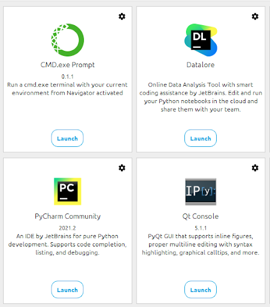

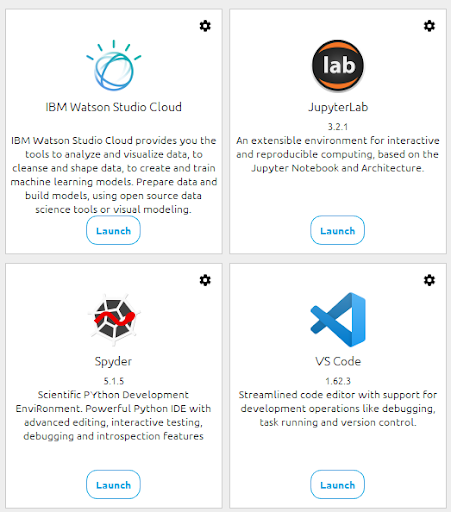

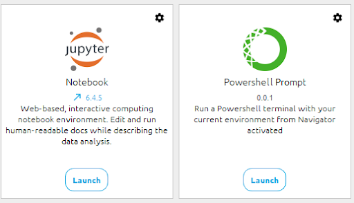
<p>A ferramenta que iremos utilizar para executar o nosso código será o Jupyter Notebook
com Anaconda Navigator aberto basta clicar em Launch no quadro Jupyter notebook, conforme ilustra imagem abaixo:</p>

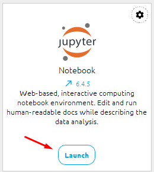

<p>outra opção para usuário do Windows abrir o Jupyter, basta buscar por Jupyter Notebook na area de pesquisa no canto inferior esquerdo e selecionar Jupyter Notebook, e também pode optar por abrir o prompt de comando do windows e digitar Jupyter notebook e teclar enter, ao ambiente para desenvolvimento estará aberto conforme ilustra a figura abaixo.</p>

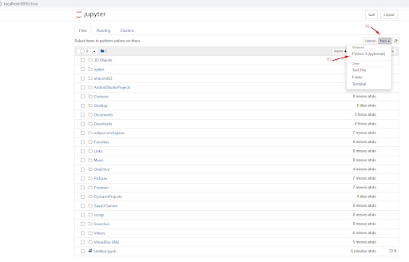

<p>Em seguida clique em New, no canto superior direito, e depois clique em Python 3 (ipykemel).</p>

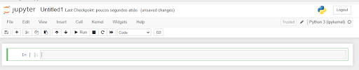

<p>para execução dos nossos código será necessario a instalação da biblioteca Pandas, portanto abra o prompt de comando CMD ou equivalente e execute o comando >>> pip install pandas</p>

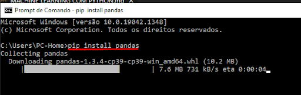


# Tratamento de Dados no Python
## Introdução ao Pandas

<p>Pronto já podemos iniciar o nosso trabalho com o código.</p>

### Obs: Para execução dos códigos, teremos como base instruções do canal Didática Tech
### Acesse o site: [Didática Tech](https://didatica.tech/)
### Canal [Didática Tech no YouTube](https://www.youtube.com/watch?v=an54pc9BW4I)


-------------------------------------------------------------------------------------------------

### Criando um dicionário python
<p>nota: dicionário é um conjunto de dados contendo chave e valor, chave sempre a esquerda dos : (dois pontos), e logicamente o valor a direita dos dois pontos, obs: o valor pode receber uma lista, seja strings, inteiros, floats etc.</p>
Obs2: dicionário está sempre entre chaves{}, lista entre colchetes[] e tuplas entre parênteses().
</br>

```python
import pandas as pd  #importação da biblioteca Pandas do Python, em: "as pd" estou apelidando pandas como "pd". 
```

```python

alunos = {'Nome':['joão', 'Maria', 'Bernardo', 'Paulo', 'Lorena'],    # Dicionário alunos
            'Nota':[5, 7.2, 5.7, 10, 8.9],
            'Aprovado':['não', 'sim', 'não', 'sim', 'sim']}
```
```python
print(alunos) #para imprimir o dicionário alunos, para verificar como ficou

```
<p>Clique em "Rum" e veja a saída conforme ilustra a figura abaixo:</p>

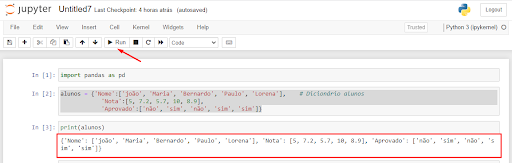

### Criando um DataFrame a partir de um dicionário python

```python
alunos_df = pd.DataFrame(alunos)  # criação de um DataFrame a partir do dicionário alunos sendo atribuiído a variável alunos_df
```
```python
print(alunos_df) #print para imprimir o DataFrame alunos_df
```
<p>Clique em Rum novamente para executar o código e veja o resultado da saída conforme ilustra abaixo</p>

```python
       Nome  Nota Aprovado
0      joão   5.0      não
1     Maria   7.2      sim
2  Bernardo   5.7      não
3     Paulo  10.0      sim
4    Lorena   8.9      sim
```

### Criando um objeto Series a partir de um dicionário python

```python
obj = pd.Series([3, 9, 6,4, 7, 0])

```
```python
print(obj) #peço para imprimir o objeto criado

```
<p>Note que foi impresso os dados destacado em azul, dados "lista" passado entre colchetes e a área destacada em vermelho, foram os índices criados automaticamente pelo comando series, note também que ele informou o tipo de dado, sendo int e o tamanho 64 bit</p>

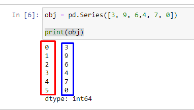

<p>Obs: o objeto do tipo series é capaz de armazenar apenas um vetor unidimensional, isso é útil para quando estamos querendo trabalhar com apenas uma coluna de dados de uma planilha.</P>
<p>Obs2: O objeto series aceita quase todos os comados Pandas utilizado no DataFrame.</p>

### Comando "head" do Pandas
```python
alunos_df.head()

```
<p>O comando "head" serve para imprimir as primeiras linhas de um DataFrame, note que fica parecido com o comando "print", mas com algumas diferenças, tipo, fica em negrito o cabeçalho da tabela, gera um sombreado alternado entre as linhas, e quando "passa o mouse" sobre a tabela, a linha que se encontra a seta do mouse muda de cor .</p>

### Comando "shape" do Pandas
```python
alunos_df.shape

```
```python
(5, 3)    # resultado do comando shape, informando quantas linhas quantas colunas possui o DataFrame alunos_df, sendo 5 linhas e 3 colunas.

```
### Comando para função "describe" do Pandas

```python
alunos_df.describe()

```

```python
Nota
count	5.000000  # Aqui o describe informa quantos dados possui com base no número de linhas
mean	7.360000  # Valor da média
std	2.103093  # Desvio padrão
min	5.000000  # Valor mínimo
25%	5.700000  # Percentil 25
50%	7.200000  # Percentil 50
75%	8.900000  # Percentil 75
max	10.000000 # Valor máximo
```
## Filtrando dados em um DataFrame

### Filtrando colunas em um DataFrame
<p>Para filtrar uma coluna, basta passar o nome da coluna entre aspas dentro dos colchetes no Dataframe, conforme ilustração abaixo</p>

```python
alunos_df['Aprovado'] # filtrar apenas a coluna Aprovados
```
```python
0    não
1    sim
2    não
3    sim
4    sim
Name: Aprovado, dtype: object
```
### Filtrando linhas em um DataFrame, comando "loc"

```python
alunos_df.loc[[0]]  # entre colchetes informo o índice  que quero filtrar
```
```python

Nome	Nota	Aprovado
0	joão	5.0	não    # resultado para índice zero.
```

```python
alunos_df.loc[1:4] # é possivel especificar a faixa em que quero filtrar, nesse exemplo do índice 1 ao índice 4
```

```python

    Nome	  Nota  	  Aprovado
1	Maria     7.2	       sim
2	Bernardo  5.7          não
3	Paulo	  10.0	       sim
4	Lorena    8.9	       sim
```

## Efetivamente trabalhando com Machine Learning